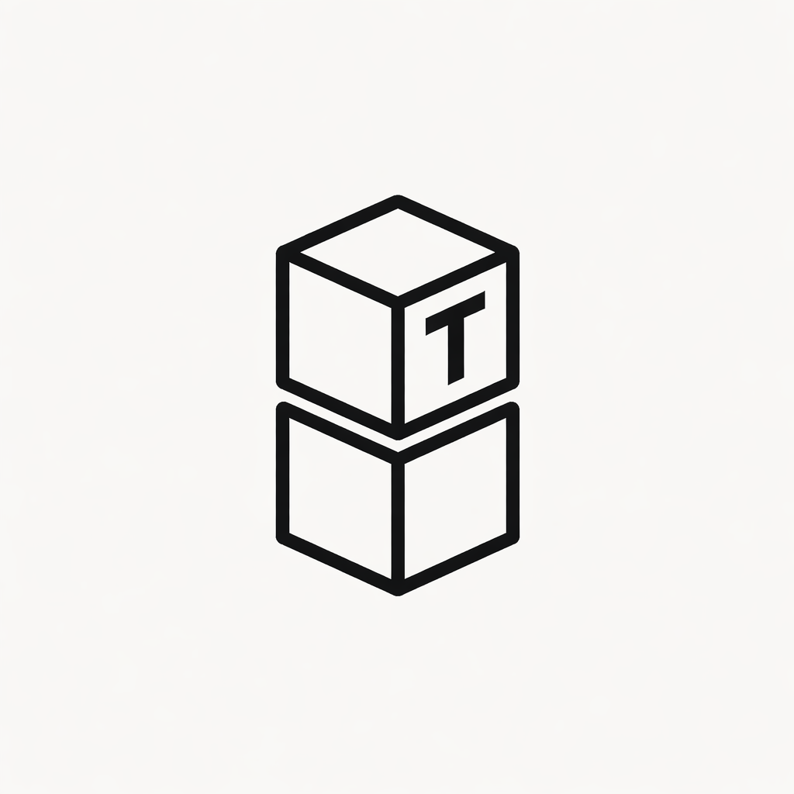

<p align="center">
  
</p>

<p align="center"><strong>Always Exceptional Design.</strong></p>
<p align="center"><strong>A global, file-based talent library for coding agents.</strong></p>
<p align="center">Capture real workflows. Reuse them everywhere. Keep the source of truth in plain files.</p>

<p align="center">
  <a href="https://github.com/WLKRLABS/tall-talents/stargazers">
    
  </a>
  <a href="https://github.com/WLKRLABS/tall-talents/actions/workflows/ci.yml">
    
  </a>
  
  <a href="LICENSE">
    
  </a>
</p>

Tall Talents is the reference implementation and tooling for the live global library at `~/.tall-talents`.

If you already solved a painful workflow once, Tall Talents gives you a strict place to capture it, validate it, and reuse it later instead of rediscovering it under pressure.

> No apps.
>
> No databases.
>
> No abstractions.
>
> Just files.

## 🚀 Why Tall Talents Exists

Most hard-won agent workflows disappear into chat history, terminal scrollback, or personal memory.

That is wasted leverage.

Tall Talents turns those one-off wins into reusable operational assets:

- a global live folder at `~/.tall-talents`
- one package folder per real workflow
- strict rules and templates so the library stays usable
- small deterministic scripts so setup, validation, and indexing stay trustworthy
- a repo-live contributor mode so the public repository can act as the working source when needed

## 🧩 What a Talent Actually Is

A talent is a reusable operational workflow package. Its activation surface is `TALENT.md`, and its package-local history lives in `CHANGELOG.md`.

It is not a vibe, a persona, or a generic best-practices checklist.

It is something you actually struggled through, solved, and would want an agent to follow literally the next time the same class of problem appears.

If handing that file to an agent would produce a meaningfully better outcome than starting from scratch, it qualifies as a talent.

## 🔍 Why This Repo Is Different

Tall Talents is deliberately narrow.

- `~/.tall-talents` is the live system, not a hidden database
- `bootstrap/` is the distributable snapshot of that live system
- `bootstrap/talents/<slug>/TALENT.md` and `CHANGELOG.md` are the real reviewable assets
- `rules/` and `templates/` define the contract
- `scripts/` keep install, validation, sync, and rebuild behavior deterministic
- `.github/workflows/ci.yml` verifies the bootstrap snapshot on macOS

This repo is small enough to inspect quickly and strict enough to trust under real use.

## ✨ What You Get

- Global live library bootstrap for `~/.tall-talents`
- Strict talent rules and reusable templates
- A validator that enforces format and structure
- An index rebuild script driven by active talent packages
- A safe talent scaffolder
- A doctor script for environment checks
- Repo-live dev mode for contributors working directly against `bootstrap/`
- A shipped library of active talents instead of placeholder demo content

## 🎨 The Talent Roster

Tall Talents currently ships with `60` active talents in [`bootstrap/talents/`](bootstrap/talents/) and a canonical snapshot index at [`bootstrap/index.md`](bootstrap/index.md).

The grouped roster below is a README browsing aid modeled for quick scanning. The files in `bootstrap/talents/` remain the source of truth.

### 🧭 Planning, Discovery, and Product Direction

| Talent | Focus | When to Use |
| --- | --- | --- |
| [Architecture Decisioning](bootstrap/talents/architecture-decisioning/TALENT.md) | Domain-first architecture, ADRs, trade-offs | Choosing system shape or documenting a major technical direction |
| [Design Before Build](bootstrap/talents/design-before-build/TALENT.md) | Context discovery, option analysis, design review | Before implementation when the shape of the solution is still unclear |
| [Implementation Planning](bootstrap/talents/implementation-planning/TALENT.md) | Exact files, tasks, tests, acceptance criteria | Turning an approved design into execution-ready work |
| [Product Requirements](bootstrap/talents/product-requirements/TALENT.md) | Goals, non-goals, evidence, risks, launch intent | Defining what should be built before delivery starts |
| [PWA Conversion Architect](bootstrap/talents/pwa-conversion-architect/TALENT.md) | Honest PWA fit and upgrade paths | Auditing or implementing a minimal viable PWA conversion |
| [Repo Onboarding Map](bootstrap/talents/repo-onboarding-map/TALENT.md) | Facts-only repo orientation and execution tracing | Getting familiar with an unfamiliar codebase quickly |
| [Sprint Prioritization](bootstrap/talents/sprint-prioritization/TALENT.md) | Capacity, dependencies, scope control | Deciding what belongs in the next sprint |
| [Workflow Mapping](bootstrap/talents/workflow-mapping/TALENT.md) | States, branches, handoffs, cleanup paths | Discovering how a real system or process actually behaves |
| [Workflow Orchestration](bootstrap/talents/workflow-orchestration/TALENT.md) | Phase gates, retries, structured handoffs | Coordinating multi-phase delivery with explicit control points |
| [UX Foundation](bootstrap/talents/ux-foundation/TALENT.md) | Interface structure, component boundaries, interaction rules | Converting approved UX scope into buildable UI foundations |
| [UX Research](bootstrap/talents/ux-research/TALENT.md) | User-behavior evidence and synthesis | Replacing intuition with observed user evidence |
| [Trend Research](bootstrap/talents/trend-research/TALENT.md) | Market, competitor, and timing evidence | Bringing outside-world research into product and strategy decisions |
| [Feedback Synthesis](bootstrap/talents/feedback-synthesis/TALENT.md) | Normalize and quantify raw user feedback | Turning messy qualitative input into usable priorities |

### 🛠️ Delivery, Refactoring, and Repository Operations

| Talent | Focus | When to Use |
| --- | --- | --- |
| [Automation Governance](bootstrap/talents/automation-governance/TALENT.md) | Automation approval, fallback, ownership, audit standards | Evaluating whether a proposed automation should exist at all |
| [Finish open worktrees into the integration branch safely](bootstrap/talents/branch-finish-workflow/TALENT.md) | Open worktrees, branch drift, safe integration | Closing scattered local branches without losing real work |
| [DevOps Automation](bootstrap/talents/devops-automation/TALENT.md) | Reproducible, observable, reversible delivery systems | Building CI/CD and infrastructure automation |
| [Fix macOS ad-hoc codesign fallback for local binaries](bootstrap/talents/fix-ad-hoc-codesign-fallback/TALENT.md) | Deterministic local binary repair | Recovering broken unsigned macOS binaries |
| [Fix GitHub Pages asset paths for project subfolder sites](bootstrap/talents/gh-pages-site-subfolder-assets/TALENT.md) | Subpath-safe asset linking | Static sites that break when served from a repo subpath |
| [Game Live Preview Workspace](bootstrap/talents/game-live-preview-workspace/TALENT.md) | Local game preview setup | Keeping Codex and a playable game surface side by side |
| [Initialize a private GitHub repo with SSH alias](bootstrap/talents/github-private-repo-init-ssh/TALENT.md) | Safe private repo creation | Turning a local folder into a private GitHub repo with the intended SSH identity |
| [Set per-repo GitHub SSH identity via host alias](bootstrap/talents/github-ssh-repo-alias-setup/TALENT.md) | Repo-local SSH auth and Git identity | Fixing GitHub push and PR auth problems for one repo |
| [Literal WordPress port mode for static migration parity](bootstrap/talents/literal-wordpress-port-mode/TALENT.md) | Near-1:1 migration discipline | Porting a legacy WordPress site before cleanup or redesign |
| [Minimal Diff Execution](bootstrap/talents/minimal-diff-execution/TALENT.md) | Smallest justifiable patch discipline | Keeping scope tight and the diff honest |
| [Parallel Agent Dispatch](bootstrap/talents/parallel-agent-dispatch/TALENT.md) | Safe parallel investigations or implementations | Splitting independent work without stepping on shared context |
| [Plan Execution](bootstrap/talents/plan-execution/TALENT.md) | Faithful execution of an approved plan | Implementing from a written plan without drifting |
| [Acquire reusable talents from external repositories](bootstrap/talents/repo-talent-acquisition-pass/TALENT.md) | Mine repos for durable workflow patterns | Turning solved external work into Tall Talents candidates |
| [Release Cut and Publish](bootstrap/talents/release-cut-and-publish/TALENT.md) | Release hardening, tag, and publish flow | Cutting and verifying a versioned GitHub release |
| [Sprite Sheet Background Cleanup](bootstrap/talents/sprite-sheet-background-cleanup/TALENT.md) | Transparent sprite-sheet asset cleanup | Removing only background pixels while preserving character details |
| [Subagent Task Loop](bootstrap/talents/subagent-task-loop/TALENT.md) | One task-scoped implementer loop with review gates | Running staged implementation with enforced QA loops |
| [Vercel Git Connect SSH Alias](bootstrap/talents/vercel-git-connect-ssh-alias/TALENT.md) | Vercel repo connection with local SSH alias preserved | Connecting Vercel to GitHub without breaking local custom remotes |
| [Worktree Isolation](bootstrap/talents/worktree-isolation/TALENT.md) | Dedicated branch, workspace setup, baseline proof | Starting risky work in a clean isolated workspace |

### 🔎 Review, Debugging, and Quality Control

| Talent | Focus | When to Use |
| --- | --- | --- |
| [API Validation](bootstrap/talents/api-validation/TALENT.md) | Contract, auth, errors, integration, performance | Verifying APIs with a traceable test matrix |
| [Code Review](bootstrap/talents/code-review/TALENT.md) | Evidence-first review findings | Reviewing completed work for bugs, regressions, and risk |
| [Compliance Review](bootstrap/talents/compliance-review/TALENT.md) | Legal, regulatory, and audit gap assessment | Determining whether a system is compliant enough to ship |
| [Incident Response](bootstrap/talents/incident-response/TALENT.md) | Structured incident handling and follow-through | Managing active production incidents and their aftermath |
| [Performance Benchmarking](bootstrap/talents/performance-benchmarking/TALENT.md) | Baselines, realistic tests, bottleneck analysis | Measuring speed and reporting pass or fail against targets |
| [Release Readiness Audit](bootstrap/talents/release-readiness-audit/TALENT.md) | Skeptical go/no-go assessment | Deciding whether a release is truly ready |
| [Review Feedback Triage](bootstrap/talents/review-feedback-triage/TALENT.md) | Accept, clarify, push back, or escalate | Handling review comments without knee-jerk changes |
| [Security Review](bootstrap/talents/security-review/TALENT.md) | Threat modeling and remediation verification | Assessing security posture and closing real risk |
| [Supabase Admin Password Reset](bootstrap/talents/supabase-admin-password-reset/TALENT.md) | Secret-minimizing auth recovery | Resetting an existing Supabase Auth password without exposing credentials |
| [Supabase Hosted Auth Email Repair](bootstrap/talents/supabase-hosted-auth-email-repair/TALENT.md) | Hosted auth email/provider repair | Restoring Supabase email login after config drift |
| [Systematic Debugging](bootstrap/talents/systematic-debugging/TALENT.md) | Single-hypothesis root-cause debugging | Untangling hard bugs without random guessing |
| [Verification Gate](bootstrap/talents/verification-gate/TALENT.md) | Fresh proof before claiming success | Blocking unverified completion claims |
| [Visual Evidence QA](bootstrap/talents/visual-evidence-qa/TALENT.md) | Screenshot-backed UI and interaction QA | Checking visual quality with captured evidence |

### 📚 Documentation, Communication, and Community

| Talent | Focus | When to Use |
| --- | --- | --- |
| [Documentation Pass](bootstrap/talents/documentation-pass/TALENT.md) | Source-grounded docs with tested examples | Rewriting or repairing documentation without drift |
| [Executive Briefing](bootstrap/talents/executive-briefing/TALENT.md) | Decision-ready summaries with owners and timelines | Condensing validated findings for leadership |
| [Handoff Contracts](bootstrap/talents/handoff-contracts/TALENT.md) | Task, QA, escalation, and phase handoffs | Preserving context across people, phases, or agents |
| [Upgrade a README into a source-grounded showcase page](bootstrap/talents/source-grounded-readme-upgrade/TALENT.md) | Public-facing README upgrades without fabrication | Turning a repo README into a credible landing page |
| [Build authentic Reddit community presence](bootstrap/talents/reddit-community-presence/TALENT.md) | Value-first subreddit participation | Planning Reddit community work without spam or rule-breaking |

## 🗂️ Global System

All live talents live here:

```bash
~/.tall-talents
```

Structure:

```bash
~/.tall-talents/
├─ index.md
├─ talents/
│  └─ <slug>/
│     ├─ TALENT.md
│     └─ CHANGELOG.md
├─ incoming/
├─ archive/
├─ reports/
└─ private/
```

This is the single source of truth.

## ⚡ Install

### Quick install

Use a tagged release so the installer and bootstrap snapshot come from the same reviewed version:

```bash
TALL_TALENTS_REF=v1.0.0 bash <(curl -fsSL https://raw.githubusercontent.com/WLKRLABS/tall-talents/v1.0.0/scripts/install.sh)
```

That bootstraps `~/.tall-talents` without cloning the repo first.

### Optional verify

```bash
bash <(curl -fsSL https://raw.githubusercontent.com/WLKRLABS/tall-talents/v1.0.0/scripts/doctor.sh)
```

### Local repo workflow

```bash
git clone https://github.com/WLKRLABS/tall-talents.git
cd tall-talents
bash scripts/install.sh
python3 scripts/dev-env.py install
bash scripts/doctor.sh
python3 scripts/validate-talents.py --root ~/.tall-talents
python3 scripts/rebuild-index.py --root ~/.tall-talents
```

`python3 scripts/dev-env.py install` is maintainer and contributor mode.
It points `~/.tall-talents` at this clone's `bootstrap/` directory and enables the committed pre-commit hook so talent edits happen directly in the repo while derived files stay synchronized.

If you already have unsynced local live-library changes that should be imported into this clone first:

```bash
python3 scripts/dev-env.py install --import-live --confirm-public-import
```

Review the live files before importing. `--import-live` only imports public bootstrap candidates, skips `private/`, `.env*`, logs, keys, and PEM files, and runs the privacy scanner after import.

## 🤖 How Agents Use It

Start any non-trivial task with:

```text
Use Tall Talents.
```

Then:

1. Read `~/.tall-talents/index.md`
2. Open only the relevant `~/.tall-talents/talents/<slug>/TALENT.md` files
3. Name the matching talent or talent set being used
4. For larger tasks, pick a primary talent plus supporting talents and state the execution order
5. If the user explicitly invoked a non-Tall-Talents Codex skill, plugin, or slash-style workflow, let that workflow control by default
6. Add Tall Talents under that external workflow only when it covers a separate uncovered stage or the user asks for Tall Talents too
7. Apply their procedures literally
8. If none fit, say so explicitly and do not force-fit one
9. Load package changelogs and helper assets only when the selected `TALENT.md` requires them or when self-iteration is changing that package

This is the discipline:

- solve something real
- turn it into a reusable workflow
- stop paying the same thinking cost twice

## 🧠 Persistent Agent Instructions

This repo also ships [`agent-instructions.md`](agent-instructions.md).

That file is the portable persistent instruction set for this project.
You can paste it into Codex personalization, project instructions, or any other agent's saved system prompt/custom-instructions field to make Tall Talents the default operating discipline instead of a one-off reminder in chat.

It tells the agent:

- when to activate Tall Talents
- when to skip Tall Talents for trivial work
- when an explicitly invoked Codex skill or plugin takes precedence over nearby Tall Talents
- which files to inspect before solving
- how to apply one or more existing talents without force-fitting them
- how to decide between creating, updating, archiving, splitting, or making no talent change after the task

If you want an agent to work on this repo consistently, use `agent-instructions.md` as the persistent prompt and keep the repo-local `README.md` plus `~/.tall-talents` library as the operational source of truth.

## 🛠️ Create or Update a Talent

After solving something difficult:

1. Use `templates/create-talent-from-session.md`
2. Decide whether this should be a new talent, an update to an existing talent, or no talent at all
3. Run a publishability pass: remove secrets and replace private names, paths, emails, account names, private repo names, and customer data with placeholders
4. Write the package in `~/.tall-talents/talents/<slug>/`
5. Append `CHANGELOG.md` with session, change, evidence, effect, and oscillation check
6. In repo dev mode, those edits land directly in `bootstrap/`
7. Derived files refresh automatically at commit time via the repo hook
8. Outside repo dev mode, run manual bootstrap sync
9. Validate the library and run the privacy scanner

## 🔁 Self-Iteration

Tall Talents is meant to improve itself without a human review queue.

After every non-trivial conversation, the agent should run a self-iteration pass:

- write a raw local report under `private/self-iteration/`
- write a sanitized report under `reports/self-iteration/` only when safe
- make no talent change unless concrete conversation evidence exists
- refine, create, archive, or split talents when the evidence threshold is met
- append the affected package `CHANGELOG.md`
- run validation, index rebuild, privacy scan, and diff hygiene checks

Concrete evidence means at least one of:

- the talent caused measurable waste
- the talent prevented or caught a real failure
- the talent missed a needed repeatable rule
- a talent should have activated but did not

Do not self-edit for vibes, nicer wording, or model confidence. Do not auto-merge talents yet.

## 🔐 Personal Work Without Leaking Secrets

Tall Talents can come from personal work. The committed talent should still be safe to publish.

Use personal experience to shape the workflow, then commit the reusable version:

- replace private values with placeholders such as `<project-root>`, `<github-owner>`, `<repo-name>`, `<customer-name>`, or `<provider-token>`
- keep commands, decision rules, failure modes, and verification steps
- remove secrets, service-role values, reset links, auth headers, tokens, passwords, customer data, private URLs, and copied private logs
- move owner-only context into `~/.tall-talents/private/`, which is local-only and not part of the shipped bootstrap manifest
- keep raw self-iteration reports in `~/.tall-talents/private/self-iteration/`
- commit only sanitized report cards under `~/.tall-talents/reports/self-iteration/`

The repo includes `scripts/scan-talent-privacy.py` for high-confidence secret checks. It fails on obvious secrets and warns on personal identifiers that should usually become placeholders before publishing.

Privacy scans are guardrails, not proof of safety. Do a human publishability review before committing imported or newly written talents.

## 📋 Commands

```bash
bash scripts/install.sh
bash scripts/doctor.sh
bash scripts/smoke-public-workflow.sh
bash scripts/smoke-github-install.sh --owner <github-owner> --ref main
bash scripts/validate-versioning.sh
bash scripts/release-dry-run.sh --github-owner <github-owner> --ref main
python3 scripts/validate-talents.py --root ~/.tall-talents
python3 scripts/rebuild-index.py --root ~/.tall-talents
python3 scripts/create-talent.py --title "My Talent" --summary "One-line summary"
python3 scripts/self-iteration.py create-report --session "<session-id>" --visibility private
python3 scripts/scan-talent-privacy.py --root ~/.tall-talents
python3 scripts/dev-env.py install
python3 scripts/dev-env.py install --import-live --confirm-public-import
python3 scripts/dev-env.py status
python3 scripts/dev-env.py uninstall
python3 scripts/sync-bootstrap.py --live-root ~/.tall-talents --bootstrap-root bootstrap
```

## 📜 Philosophy

- Files are the source of truth
- No hidden state
- No automation magic
- No generic advice
- Only real, reusable workflows

A talent should exist only if you would actually reuse it.

## 🚫 What This Is Not

- Not an agent framework
- Not a SaaS product
- Not a prompt library
- Not a memory system

It is a discipline backed by a folder.

## ✅ How The Repo Proves Itself

This repository does not just describe the idea.
It includes the pieces required to keep the idea honest:

- `scripts/install.sh` initializes the live folder from a local clone or a raw GitHub install path
- `scripts/dev-env.py` switches `~/.tall-talents` into repo-live contributor mode and restores the prior root on uninstall
- `scripts/doctor.sh` verifies environment and folder layout
- `scripts/smoke-public-workflow.sh` runs local-install and remote-style-install smoke coverage through doctor, validator, rebuild, and create/validate checks
- `scripts/validate-talents.py` enforces the talent format contract
- `scripts/scan-talent-privacy.py` blocks high-confidence secrets in talents and warns on personal identifiers
- `scripts/rebuild-index.py` regenerates `~/.tall-talents/index.md`
- `scripts/create-talent.py` scaffolds new talent packages
- `scripts/self-iteration.py` handles report-card and package changelog file mechanics
- `scripts/sync-bootstrap.py` imports a live library into `bootstrap/` or regenerates derived files in place
- `.github/workflows/ci.yml` runs the public-workflow smoke gate on `push` and `pull_request`

## 🔢 Versioning

This repo uses SemVer.

- `VERSION` is the repository version marker
- `CHANGELOG.md` tracks `Unreleased` work plus released versions
- [`VERSIONING.md`](VERSIONING.md) defines the version, changelog, and tag contract
- [`RELEASE.md`](RELEASE.md) is the release playbook, including canonical-home cutover rules
- `scripts/validate-versioning.sh` validates the version/changelog contract
- `scripts/release-dry-run.sh` proves the release path through local, remote-style, and live GitHub install smoke coverage
- `1.0.0` is the stability target for the file format, tooling, and workflow

Current version: `1.0.0`

## ⭐ GitHub Stars

If Tall Talents is useful, star the repo.
Stars are the simplest signal that the project is solving a real problem for real people.

[](https://star-history.com/#WLKRLABS/tall-talents&Date)

## ☕ Support the Project

If Tall Talents saves you time:

- Star the repository
- Open issues or pull requests with real improvements
- Share the project with people building serious agent workflows

Buy me a coffee support link coming soon.

<!-- Replace the line above with the real Buy Me a Coffee URL when it exists publicly. -->

## 🏷️ A WLKR LABS Product

Tall Talents is a WLKR LABS product.

That means the project is intentionally opinionated about a few things:

- boring, inspectable systems beat clever hidden ones
- plain files beat opaque state when the asset is knowledge
- strict workflows beat loose prompts when repeatability matters
- small tools with sharp edges beat large systems with fuzzy boundaries

Built and maintained by WLKR LABS.

## 📄 License

MIT.
